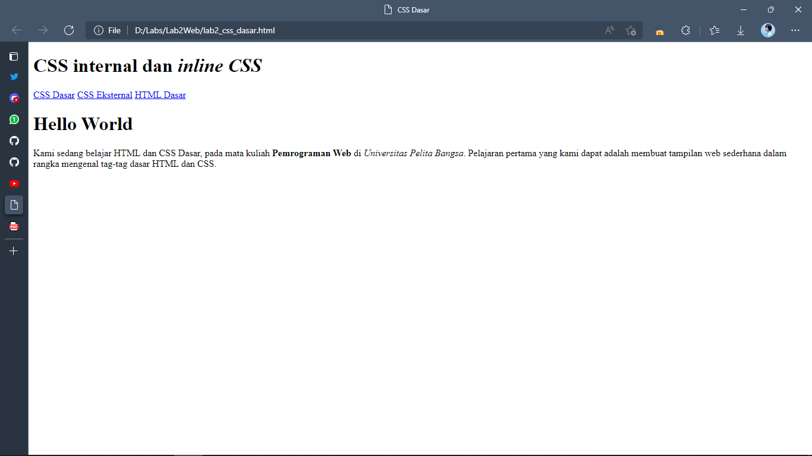

# Lab2Web

| INDIRA ALINE    |   312010042   |
|-----------------|---------------|
|   TI. 20 A. 1   |PEMROGRAMAN WEB|
|     HTML        |    CSS        |

### Pertemuan 3
Untuk mata kuliah kali ini membahas tentang membuat website dengan HTML dan CSS Dasar seperti CSS ***inline***, ***internal***,dan juga ***eksternal*** serta selector **ID** dan juga **Class**

## 1). Langkah pertama buat dokumen dasar HTML
### Output 

Disini terdapat sebuah dokumen dasar HTML namun belum beserta CSS atau hanya masih file HTML dasar nya saja, belum diberi CSS ***inline*** **internal** ataupun **eksternal**

### Contoh coding
```html
<!DOCTYPE html>
<html lang="en">
<head>
    <meta charset="UTF-8">
    <meta http-equiv="X-UA-Compatible" content="IE=edge">
    <meta name="viewport" content="width=device-width, initial-scale=1.0">
    <title>CSS Dasar</title>
</head>
<body>
    <header>
        <h1>CSS internal dan <i>inline CSS</i></h1>
    </header>
    <nav>
        <a href="lab2_css_dasar.html">CSS Dasar</a>
        <a href="lab2_css_eksternal.html">CSS Eksternal</a>
        <a href="lab1_tag_dasar.html">HTML Dasar</a>
    </nav>
    <!-- CSS ID Selector -->
    <div id="main">
        <h1>Hello World</h1>
        <p>Kami sedang belajar HTML dan CSS Dasar, pada mata kuliah <b>Pemrograman Web</b> di <i>Universitas Pelita Bangsa</i>. Pelajaran pertama yang kami dapat adalah membuat tampilan web sederhana dalam rangka mengenal tag-tag dasar HTML dan CSS.</p>
    </div>
</body>
</html>
```
