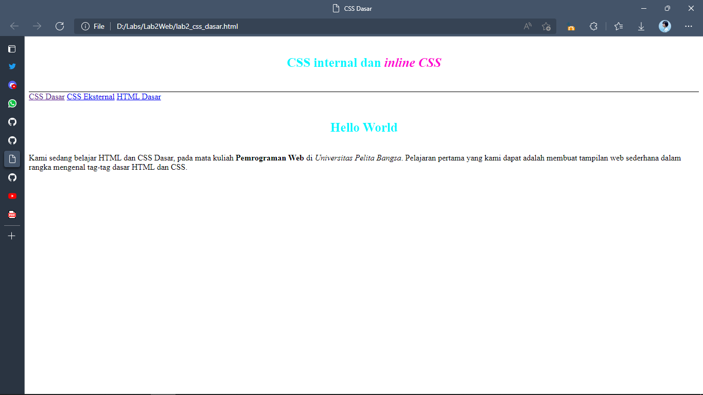
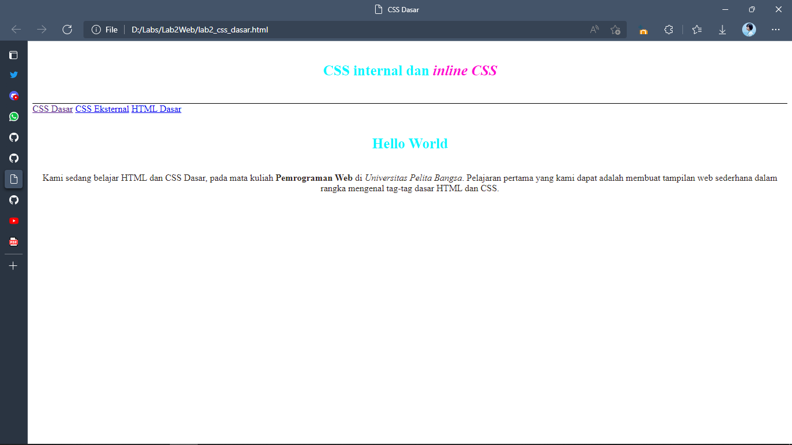

# Lab2Web

| INDIRA ALINE    |   312010042   |
|-----------------|---------------|
|   TI. 20 A. 1   |PEMROGRAMAN WEB|
|     HTML        |    CSS        |

### Pertemuan 3
Untuk mata kuliah kali ini membahas tentang membuat website dengan HTML dan CSS Dasar seperti CSS ***inline***, ***internal***,dan juga ***eksternal*** serta selector **ID** dan juga **Class**

## 1). Langkah pertama buat dokumen dasar HTML
### Output 

Disini terdapat sebuah dokumen dasar HTML namun belum beserta CSS atau hanya masih file HTML dasarnya saja, belum diberi CSS ***inline*** **internal** ataupun **eksternal**

### Contoh coding
```html
<!DOCTYPE html>
<html lang="en">
<head>
    <meta charset="UTF-8">
    <meta http-equiv="X-UA-Compatible" content="IE=edge">
    <meta name="viewport" content="width=device-width, initial-scale=1.0">
    <title>CSS Dasar</title>
</head>
<body>
    <header>
        <h1>CSS internal dan <i>inline CSS</i></h1>
    </header>
    <nav>
        <a href="lab2_css_dasar.html">CSS Dasar</a>
        <a href="lab2_css_eksternal.html">CSS Eksternal</a>
        <a href="lab1_tag_dasar.html">HTML Dasar</a>
    </nav>
    <!-- CSS ID Selector -->
    <div id="main">
        <h1>Hello World</h1>
        <p>Kami sedang belajar HTML dan CSS Dasar, pada mata kuliah <b>Pemrograman Web</b> di <i>Universitas Pelita Bangsa</i>. Pelajaran pertama yang kami dapat adalah membuat tampilan web sederhana dalam rangka mengenal tag-tag dasar HTML dan CSS.</p>
    </div>
</body>
</html>
```

## 2). Mendeklarasikan CSS Internal
### Output

CSS Internal adalah CSS yang filenya terdapat didalam HTML dengan deklarasi **style**, gambar diatas adalah hanya CSS Internal saja belum terdapat inline dan eksternal.

### Contoh coding
```css
<!-- Mendeklarasikan CSS Internal -->
    <style>
        body{
            font-family: 'Times New Roman', Times, serif;
        }
        header{
            min-height: 90px;
            border-bottom: 1px solid black;
        }
        h1{
            font-size: 25px;
            color: blue;
            text-align: center;
            padding: 20px 10px;
        }
        h1 i{
            color: aqua;
        }
    </style>
```

## 3). Menambahkan Inline
### Output

 CSS ***Inline*** adalah CSS yang pendeklarasiannya ada pada tag HTML nya sendiri dengan menggunakan **style** seperti contoh di atas, saya melakukan mendeklarasikan CSS ***Inline*** pasar pada tag (p) dengan properti (text-align) dan juga (color) CSS ***Inline*** sendiri sangat spesifik dan hanya merubah pada tag yang hanya diberi **style** CC ***Internal*** sangat kuat, maksudnya yaitu jika kita melakukan code yang sama dengan deklarasi yang berbeda yang terpanggil hanya ***Inline*** karena ***Inline*** memiliki prioritas tinggi dibanding **internal** dan **eksternal**.

 ### Contoh coding
 ```html
 <!-- Tag (p) menggunakan CSS Inline -->
        <p style="text-align: center; color: royalblue;">Kami sedang belajar HTML dan CSS Dasar, pada mata kuliah <b>Pemrograman Web</b> di <i>Universitas Pelita Bangsa</i>. Pelajaran pertama yang kami dapat adalah membuat tampilan web sederhana dalam rangka mengenal tag-tag dasar HTML dan CSS.</p>
 ```
